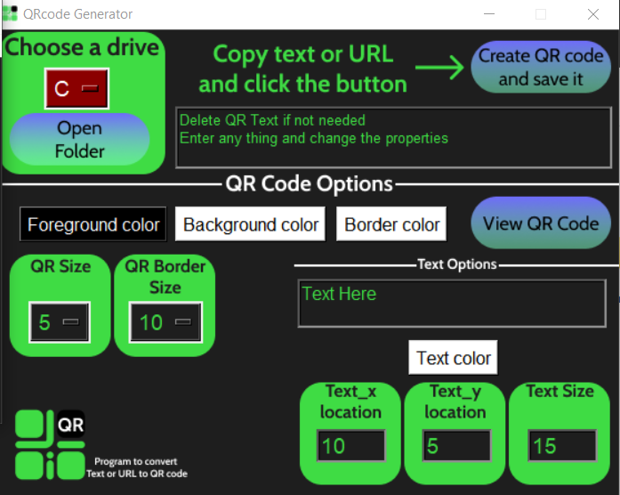
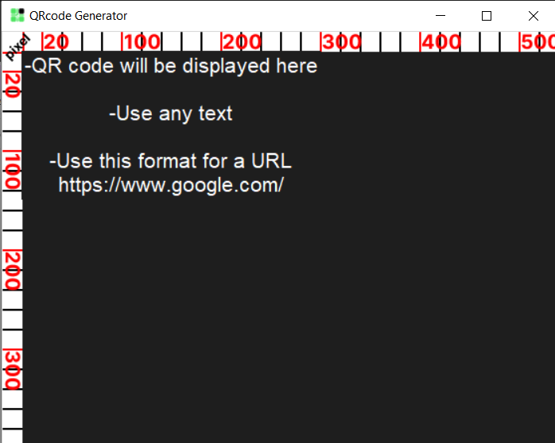

# **QRcodeGenerator**

**A tool that converts text or URL to QR code**

To download the tool [QRcodeGenerator.exe](QRcodeGenerator.exe)

to see the code [QRcodeGenerator_v5.py](QRcodeGenerator_v5.py)


---




- To use these tools
  - First download the QRcodeGenerator.exe if on Windows.
  - OR run the source code QRcodeGenerator_v5.py (need the following Libraries to run the code if the source code QRcodeGenerator_v5.py file. check the libraries section).
 
---
**How to use this tool**

first copy any text or URL using this format -> https://github.com
- To change the drive where the QR code will be saved do so before saving it.
- To create the QR code just press the button on the top right after copying the text or theURL.

**press on the View QR code to disply it on the second window (it will not be saved).**
**Edit the QR code then save it by clicking the button on the top right.**

**What can be edited**
- QR code foreground color
- QR code background color
- QR code border color
- QR code size
- QR code border size
- QR code displayed text
- QR code displayed text color
- QR code displayed text size
- QR code displayed text x (pixel) location
- QR code displayed text y (pixel) location

---

# Libraries needed for running the source code QRcodeGenerator_v5.py

- pyqrcode -> To install open command prompt(cmd) and type ```pip install PyQRCode```
- pyperclip -> To install open command prompt(cmd) and type ```pip install pyperclip```
- PIL -> To install open command prompt(cmd) and type ```pip install Pillow```
- tkinter
- OS
- from PIL import Image, ImageOps, ImageTk, ImageDraw, ImageFont
- from pyqrcode import create
- from tkinter import colorchooser

- This code also using the tkinter and OS libraries but these libraries will be already installed once Python is installed, . (To install Python check any tutorial online)

---
